```{r child = "../setup.Rmd"}
```

```{r setup1, include=FALSE}
options(htmltools.dir.version = FALSE)
library(knitr)
knitr::opts_chunk$set(warning = FALSE, message = FALSE)
library(tidyverse)
library(fontawesome) 
library(xaringanExtra)
library(xaringanthemer)
style_mono_accent(
  base_color = "#1c5253",
  header_font_google = google_font("Josefin Sans"),
  text_font_google   = google_font("Montserrat", "300", "300i"),
  code_font_google   = google_font("Fira Mono")
  )
load("~/Dropbox/Teaching/TSFE/data/fin7028_dat.RData")
```

class: middle

# Outline

.large[
- Financial data you have access to
- WRDS set up
- Asset returns
]

---
class: middle

## Wharton Research Data Services (WRDS)

.large[What is WRDS?]

.blockquote[
Wharton Research Data Services (WRDS) provides the leading business intelligence, data analytics, and research platform to global institutions—enabling historical analysis and insight into the latest innovations in academic research.
]

.large[What is LSPD]

.blockquote[
The London Share Price Database (LSPD) is a unique, comprehensive database of UK stock returns covering over 9,000 UK shares from 1955 to date. It is an invaluable resource for both academic researchers and investment practitioners. The LSPD provides a record of total returns to investors, incorporating dividends and capital changes, and includes companies whether they have survived or died. This ensures that research, back testing and performance evaluation focuses on total shareholder return, and is untainted by **survivor bias**.
]

---
class: middle

## Learning objectives

.large[
- Become conversant in building and executing WRDS web queries
- Understand survivor bias
- Learning how to process financial data

]

---
class: middle

## What is WRDS?

- WRDS stands for Wharton Research Data Services.  

- WRDS aggregates data into a standard format and then makes it available to subscribers.

- WRDS is best known for financial data—for example, stock prices from CRSP, or company fundamentals from Compustat.

- WRDS also hosts data in a variety of other disciplines including:
- .fatinline[Accouting, Banking, Management, Economics, Marketing, Healthcare, Insurance]

---
class: middle

# Getting Started

- All you need is a web browser and Internet access to query data from WRDS. 
- After you decide which dataset to use, you can use the web-based query form to extract and output data in the format of your choice.

- What follows provides instructions on how to create a web-based query. See Support for additional ways to access WRDS data.

.blockquote[
### Reproducible science skill

In future labs and homework exercises we will be using one of the most powerful feature of WRDS; WRDS Cloud, to extract data programmatically.

]

---
class: middle

.your-turn[

- Firstly create an account on WRDS using your QUB credentials

- [Link to WRDS](https://wrds-www.wharton.upenn.edu)

- Wait for lecturer to confirm your account
]

```{r echo=FALSE}
countdown(minutes = 5, warn_when = 1)
```

---
class: middle

# Class assignment

.your-turn[

Iur assignment is to access WRDS and download monthly stock prices for IBM, Amazon, and Walmart for 2020. Stock price data is provided by CRSP. 

This assignment has two parts:

Log in to the WRDS platform and locate the CRSP database.

Create a data query in CRSP and view the results.

]
```{r echo=FALSE}
countdown(minutes = 5, warn_when = 1)
```


---
class: middle

# WRDS login page


.large[
- Enter your username and password
- Click login button
]
---
class:middle

# WRDS Home Page

.pull-left-1[
- The WRDS Home page displays your data subscriptions.

- Scroll down the page to locate the CRSP dataset.

- Click on CRSP. 
]
.pull-right-2[
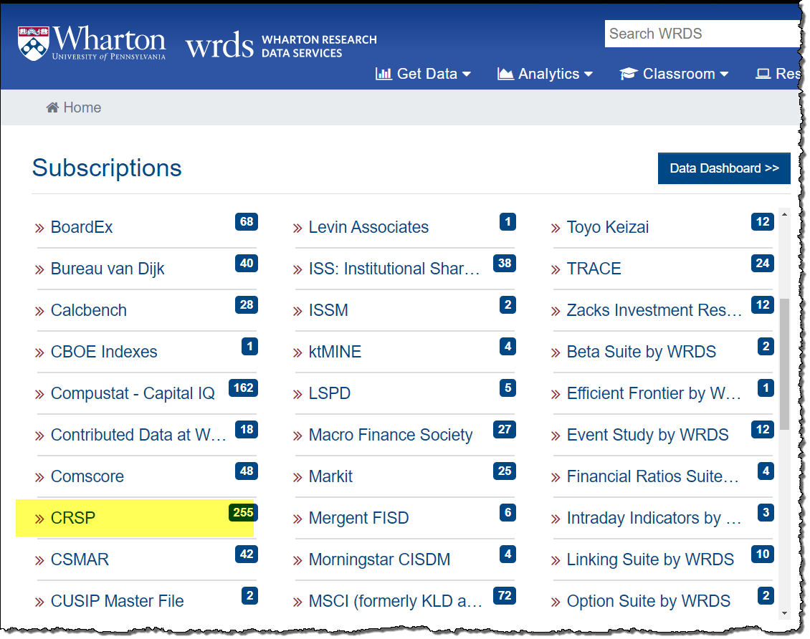
]

---
class: middle

## CRSP Page

.pull-left[
- Click on Stock/Security Files
- Click on CRSP. 
]
.pull-right[
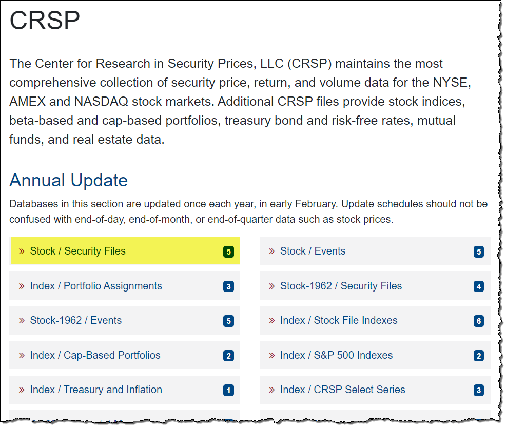
]
---
class: middle

# CRSP Stock/Security Files Page

.pull-left-2[
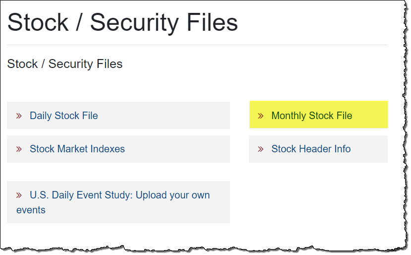
]
.pull-right-1[
Click on monthly stock file
]

---
class: middle

## CRSP Monthly Stock Data Query

.pull-left-1[
- On the query page, the first step is to select the date range for your data. 

- Enter 2020-01 to 2020-12 in the Date Variable fields. 
]
.pull-right-2[
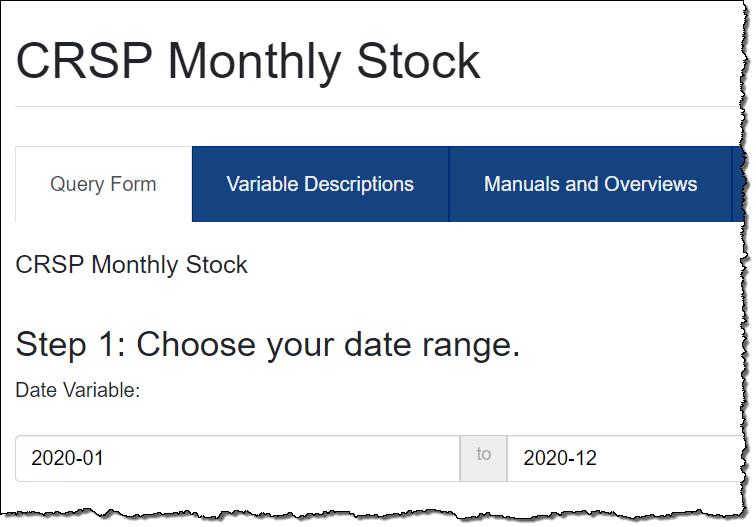
]

---
class: middle

## Enter the Companies

.pull-left-1[
- Make sure ticker is selected
- Enter the ticker symbols for the companies: IMB AMZN WMT

]
.pull-right-2[
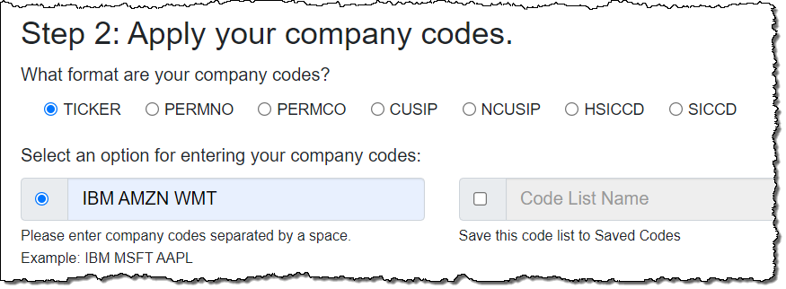
]
---
class: middle

## Select the Query Variables

.pull-left-1[

- Select the variables you want from the Query Variables list.
- For this assignment, select two variables: Ticker and Price.

]
.pull-right-2[
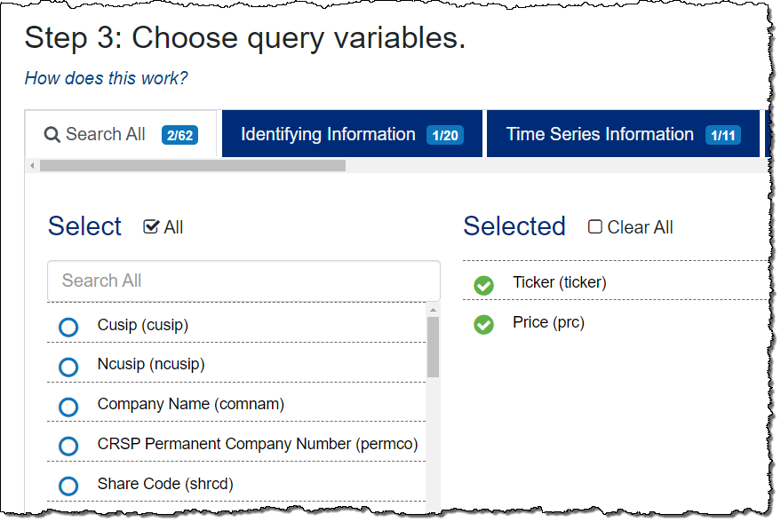
]

---
class: middle

# Select the Query Output

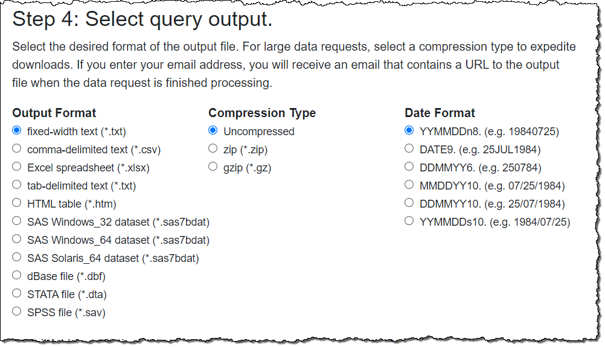

- For this assignment, select fixed-width text (*.txt), which will display the data in your browser.

---
class: middle

# Run the Query

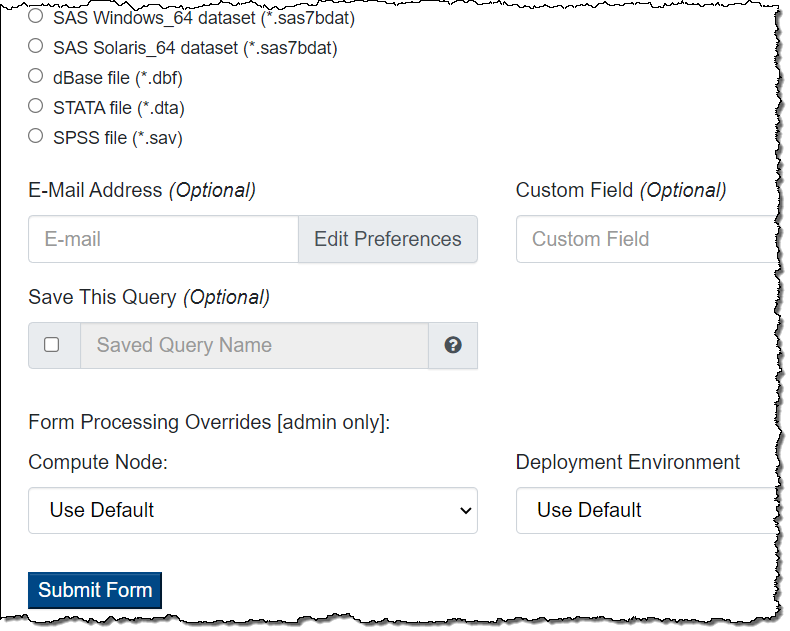

- Click the Submit From button at the bottom of the page to run the query

---
class: middle

# Query Summary

.pull-left-2[
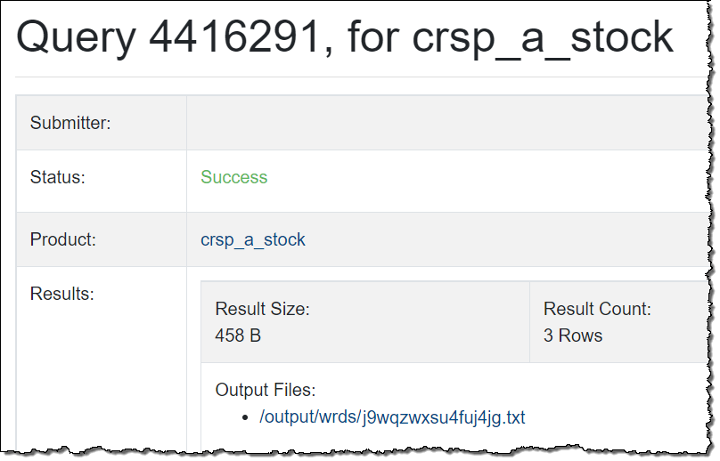
]
.pull-right-1[

- A summary page opens in a new tab, indicating the status of your query, and containing the link to your results.

- **Success** means your data is ready. 

- Click the Output files link to access the results of your query

]

---
class: middle

# Query Results

.pull-left-1[
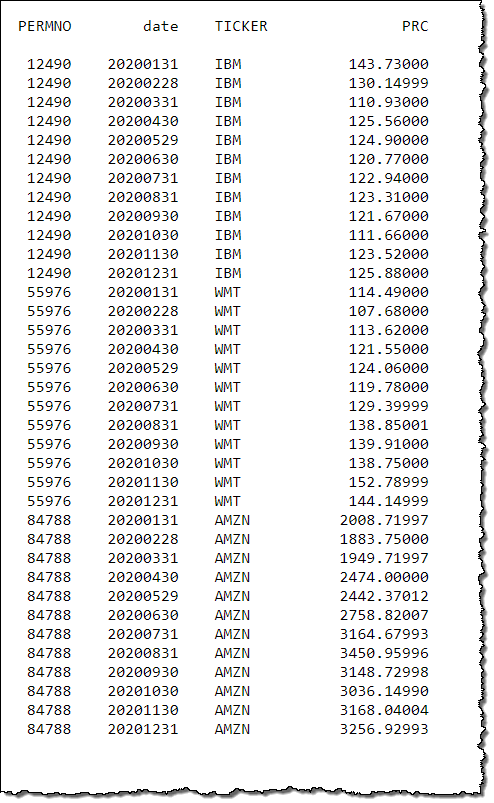
]
.pull-right-2[
The monthly stock prices for IBM, Amazon, and Walmart for 2020 are displayed. 
]

---
class: middle

# Note: Pop-Up Blocker Installed?

.pull-left-2[
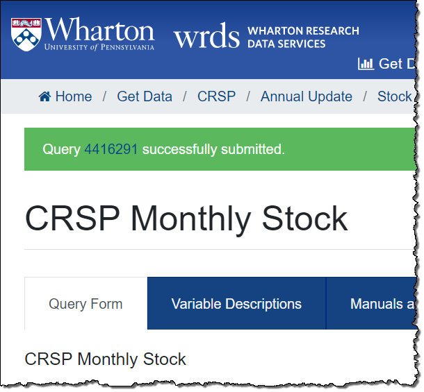
]
.pull-right-1[

- If you have a pop-up blocker on your browser, the query page will show a banner indicating the query was submitted. 

- Click the query number to proceed to the Summary screen, then click the link to access your results. 

]

---
class: middle

# Asset returns

.discussion[
- The most important financial time series are asset prices, exchange rates and interest rates.
- Most financial studies involve returns rather than prices.
- Campbell et al. (1997) gives two main reasons for using returns:
1. For an average investor, returns of an asset is a complete and scale-free summary of the investment opportunity.
2. Return series are easier to handle than price series because the former have more attractive statistical properties.
]

---
class: middle

## One-period simple returns 

- Let _P~t~_ be the price of an asset at time index _t_ and assume the asset pays no dividend.
  - **One-Period Simple Return**:
  - Holding the asset for one period from date t-1 to date t would result in a _simple gross return_

$$ 
1+R_t= \frac{P_t}{P_{t-1}} \;or\; P_t=P_{t-1}(1+R_t)
$$

* The corresponding _simple net return_ or _simple return_ is:
    
$$
R_t= \frac{P_t}{P_{t-1}}-1= \;or\; \frac{P_t-P_{t-1}}{P_{t-1}}
$$

---
class:middle

## Multiperiod simple returns 

- Holding the asset for k period between dates t-k and t gives a k period simple gross return:

$$1+R_t[k] = \frac{P_t}{P_{t-k}}=\frac{P_t}{P_{t-1}}\times\frac{P_{t-1}}{P_{t-2}} \times \dots \times \frac{P_{t-k+1}}{P_{t-k}}$$
$$=(1+R_t)(1+R_{t-1})\dots(1+R_{t-k+1})$$
$$=\prod^{k-1}_{j=0}(1+R_{t-j})$$

- The _k_ period simple gross return is simply the product of the _k_ one-period simple gross returns; or the _compound return_.
- The k-period simple net return is $R_t[k]= \frac{(P_t-P_{t-k})}{P_{t-k}}$

---
class: middle

## Time interval
* In practice, the actual time interval is important in discussing and comparing returns (e.g., monthly returns or annual returns).
* If the time interval is not given, it is implicitly assumed to be one year.
* If the asset is held for _k_ years, then the annualised (average) return is defined as:

$$\text{Annualised}\{R_t[k]\} = \left[\prod^{k-1}_{j=0}(1+R_{t-j})\right]^{1/k}-1$$

---
class:middle

## Time interval

* As one-period returns tend to be small, a first-order Taylor expansion to approximate the annualised returns is:

$$\text{Annualised}\{R_t[k]\} \approx \frac{1}{k}\sum^{k-1}_{j=0}R_{t-j}$$


* Accuracy of this approximation may not be sufficient in some applications.

---
class:middle

## Continuously compounded returns

* The natural logarithm of the simple gross return of an asset is called the _continuously compounded return_ or _log return_

$$
r_t=ln(1+R_t)=ln \left(\frac{P_t}{P_{t-1}} \right)=p_t-p_{t-1} \
\text{where }p_t=ln(P_t)
$$

### Advantages
* Firstly, continuously compounded multiperiod return is simply the sum of the continuously compounded one-period returns.

$$r_t[k]=ln(1+R_t[k])=ln[(1+R_t)(1+R_{t-1})\dots(1+R_{t-k+1})]$$

$$=ln(1+R_t)+ln(1+R_{t-1})+\dots +ln(1+R_{t-k+1})$$

$$=r_t+r_{t-1}+\dots+r_{t-k+1}$$

* Secondly, statistical properties of log returns are **tractable**, easy to calculate with.

---
class: middle

## Portfolio returns

* The simple net return of a portfolio consisting of _N_ assets is a weighted average of the simple net returns of the assets involved, where the weight on each asset is the percentage of the portfolio's value invested in that asset.

* Let _p_ be a portfolio that places weights _w~i~_ on asset _i_.  

* Then the simple return of _p_ at time _t_ is:

$$R_{p,t}=\sum_{i=1}^{N}w_iR_{it}\text{ where}\sum w_i=1$$

---
class: middle

## Portfolio returns

* log returns of a portfolio do not have this additive property, but if the simple returns _R~it~_ are all small in magnitude then we have:

$$r_{p,t} \approx \sum_{i=1}^{N}w_ir_{it}$$

* $r_{p,t}$ is the continuously compounded return of the portfolio.
* This approximation is usually used to study portfolio returns.

---
class:middle

## Dividend payment

* Asset returns must be modified if there is a periodic dividend
* Let _D~t~_ be the dividend of an asset between dates _t-1_ and _t_, the simple net return and continuously compounded return at time t become:

$$R_t= \frac{P_t+D_t}{P_{t-1}}-1 \; , \;r_t=ln(P_t+D_t)-ln(P_{t-1})$$

* This adjustment is commonly referred to as a *total return*.

---
class: middle

## Excess return
.pull-left[
* Excess returns of an assets at time _t_ is the difference between the asset's return and the return on some reference asset.
* The reference asset is often taken to be riskless such as a short-term UK government bond returns.
* In portfolio performance analysis of actively managed funds a benchmark return is often used.
* Queens Student Managed Fund (QSMF) is benchmarked against the FTSE 350 Index.
]
.pull-right[
* The simple excess return and log excess return of an asset are then defined as: 

$$Z_t=R_t-R_{0t}, \; z_t=r_t-r_{0t}$$

* where _R~0t~_ and _r~0t~_ are the simple and log returns of the reference asset, respectively. 
* In finance literature, the excess return is thought of as the payoff on an arbitrage portfolio that goes long in an asset and short in the reference assets with no net initial investment.
* In portfolio analytics, active return is the excess return compared to the *passive* benchmark return.
]

---
class:middle

## Examples

.pull-left[

.content-box-red[Simple return Vs Log returns]

```{r, echo=FALSE}
library(fpp2)
library(tidyverse)
glen %>%
  select(date,simple_return,log_return) %>%
  drop_na() %>%
  pivot_longer(!date,names_to ="Return_Type",values_to="return") %>%
  ggplot(aes(x=date,y=return)) +
  geom_line() +
  facet_wrap(~Return_Type,ncol = 1)
  
```

]
.pull-right[
.discussion[
* Plot shows a time plot of daily simple and log returns of Glencore stock from `r first(glen$date)` to `r last(glen$date)`.
* There are `r sum(!is.na(glen$log_return))` observations.
* From the plots, the behaviour of log returns is very similar to simple returns.
* The correlation coefficient between log and simple returns is 0.9997.
* This is expected, as when x is close to zero, $log(1+x) \approx x$ and daily simple returns of Glencore are small in the sampling period.
]
]
---
class:middle

## Financial Returns Characteristics

* Daily log returns are simply the change series of log prices.
* In `R`, a change series can easily be obtained by taking the *difference* of log prices `diff(log(price))`.
* In Figure 1.2  the *adjusted* daily price is used as it accounts for stock splits.
* In Figure 1.1 the total return calculations includes both stock splits and dividend income.


---
class:middle

## Inference from time plot of log returns


  1. There exist some large outlying observations
  2. The returns were volatile in certain periods but stable in others.
  We can thus infer:
  
  1. Statistically the returns have heavy tails
  2. The returns series is characterised by *volatility clustering*

---
class:middle

# Bond yields and prices

.pull-left[
### What is a Bond?

  * A financial instrument which pays the face value (par value) to its holder at the time of maturity.
  * Some bonds also pay interest periodically; *coupon payments*.
  * Zero-coupons bonds do not pay periodic interest.
  * Bond yield is the return recieved for holding a bond to maturity.
]
.pull-right[
## Current yield

  * The percentage return that the annual coupon payment provides the investor

$$ 
\text{Current Yield}_t = \frac{ \text{Annual Interest paid in dollars}}{\text{Market Price of the Bond}_t} \times 100%
$$
  
* For a zero-coupon bond the yield is defined as:
  
$$
\text{Current Yield}_t=\frac{ \text{Annual Interest paid in dollars}}{\text{Market Price of the Bond}_t}^{1/k}-1 \\
\text{where }k\text{ denotes time to maturity in years}
$$
* The definition shows it is typically time dependent ($_t$ subscript) and does not include capital gains/losses.
]

---
class: middle

## Yield to maturity

  * Considers the time value of money by equating the bond price to the present value of future payments.
  * YTM is a more common way to measure bond investment.
  * It's calculation is more complex and calibration is required to find an accurate approximation.

## Yield to maturity  

* Suppose that the bond holder will receive $k$ payments between purchase and maturity then:
  
$$
P=\frac{C_1}{1+y}+\frac{C_2}{(1+y)^2}+\dots+\frac{C_k+F}{(1+y)^k}
$$


* Where $P$ is the price of the bond, $y$ is YTM, $C_I$ is the ith coupon payment, and $F$ denotes face value.
* From the above equation the price of the bond has an inverse relationship to the YTM.

---
class: middle

## US government bonds

* US government issues various bonds to finance its debts.
* These include
1. **Treasury Notes**
2. **Treasury Bonds**
3. **Treasury Bills**

## Treasury notes

* Treasury notes (T-Notes) mature in 1-10 years.
* They have a coupon payment every 6 months and a face value of $1000
* Notes are quoted on the secondary market at percantage of face value in thirty-seconds of a point.
* For example a quote of 95:08 indicates it is trading at a discount \$(95+8/32) X 1000/100 = \$953.5
* The 10-year note is the most frequently quoted in discussions of the US government bond market.


---
class: middle

## Treasury bills

* US government issues various bonds to finance its debts.
* Treasury Bills (T-Bills) mature in one year or less.
* They pay no interest prior to maturity.
* They are sold at a *discount* of face value to create a positive yield to maturity.
* The minimum purchase is $100.
* The discount yield (%) of T-Bills is calculated via

$$
\text{Discount yield }=\frac{F-P}{F}\times\frac{360}{\text{Days till maturity}}\times \text{100}
$$
---
class:middle, inverse

## Treasury bills

* Bills are quoted differently from notes and bonds, since bills do not pay an established interest rate.
* The return on a bill is the difference betweeen the purchase and subsequent sale price, or when held to maturity, the face value paid by the Treasury.
* Thus bills are quoted at a discount to face value, with the discount expressed as an annual rate based on a 360-day years,  for example:

|ISSUE| BID |ASK| CHANGE| YIELD|
|:--:|:---:|:---:|:---:|:---:|
|12-3-98 |5.08 | 5.06 | -.03|5.26 

## Treasury bonds

* T-Bonds have longer maturities (20-30 years).
* They have a 6 month coupon payment and are commonly issued with maturities of 30 years.

---
class:middle

## Implied volatility

* Stock options are financial contracts which give the holder the right to buy (**call option**) or sell (**put option**) a stock at a prespecified price (**strike price**) within a given time period.
* Black-Scholes defines the price of an option as dependent on, the strike price, risk-free interest rate, current price and volatility of the stock.
* In practice, the stock volatility is not observed but backed out of the Black-Scholes formula as an *implied volatility* using calibration.

#### CBOE VIX index

* The VIX index is the most well-known implied volatility.
* It measures the US stock market's expectation of 30-day volatility *implied* by averaging prices of S&P 500 index puts and calls over a wide range of strike prices.
* It is often regarded as the market fear factor, and can openly be traded using VIX futures and options.

---
class: middle

# The statistical forecasting perspective


- Thing to be forecast: a random variable, $y_t$.
- Forecast distributin: If ${\cal I}$ is all observations, then $y_{t} |{\cal I}$ means `the random variable $y_{t}$ given what we know in ${\cal I}$`
- The point forecast: is the mean (or median) of $y_{t} |{\cal I}$
- The Forecast variance: is $\text{var}[y_{t} |{\cal I}]$
- A prediction interval or interval forecast is a range of values of $y_t$ with high probability.
- With time series, ${y}_{t|t-1} = y_t | \{y_1,y_2,\dots,y_{t-1}\}$.
- $\hat{y}_{T+h|T} =\text{E}[y_{T+h} | y_1,\dots,y_T]$ (a $h$-step forecast taking account of all observations up to time $T$).

